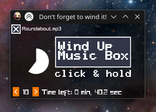

# Desktop Music Box

This GitHub page does not include the build script for Desktop Music Box, as i felt it
was way too platform specific to include in the repository. If you want to get a precompiled
copy of Desktop Music Box, you can head over to its [gamejolt page](https://gamejolt.com/games/desktopmusicbox/882763),
which current has a Windows and Linux binary.

If you want to compile it yourself, you'll need to link Raylib and Raymath, and then yea enjoy!
